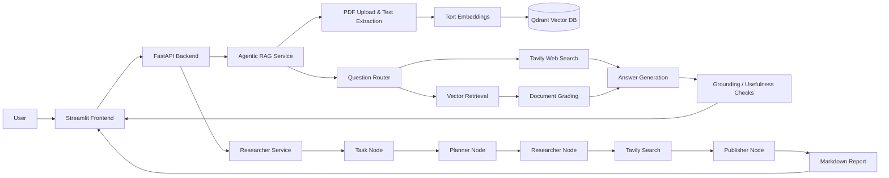

# Multi-Agent-Knowledge-Q-A-and-Research-Report-Platform

A full-stack multi-agent AI platform for **PDF knowledge-base Q&A** and **automated research report generation**. The system combines FastAPI, Streamlit, LangGraph, Qdrant, Tavily Search, and Docker Compose to provide an end-to-end workflow for document ingestion, agentic retrieval, web fallback, and Markdown report export.

## Overview

This project provides two main AI workflows:

1. **Chat with your PDF**  
   Upload a PDF, index its text content into Qdrant, and ask questions through an agentic RAG pipeline.

2. **Deep Research**  
   Enter a research topic, let the research agent plan web searches, collect information with Tavily, and synthesize a structured Markdown report.

The application is designed as a local Dockerized system with a Streamlit UI, a FastAPI backend, and Qdrant as the vector database.

## Key Features

- **PDF knowledge-base Q&A**
  - Upload and process PDF documents.
  - Extract page-level text with PyMuPDF.
  - Chunk text and store embeddings in Qdrant.
  - Ask follow-up questions through a chat interface.

- **Agentic RAG workflow**
  - Query routing between vector retrieval and optional web search.
  - Document relevance grading.
  - Answer generation.
  - Hallucination and answer usefulness checks.
  - Optional Tavily-powered web fallback.

- **Deep Research workflow**
  - User topic intake.
  - Research persona and plan generation.
  - Multiple web search query generation.
  - Tavily search execution.
  - Markdown report synthesis.
  - Saved reports and download support.

- **Full-stack application**
  - FastAPI backend with REST endpoints.
  - Streamlit frontend for user interaction.
  - Docker Compose orchestration.
  - Persistent local storage for uploads, reports, and vector data.

- **ModelScope / OpenAI-compatible model support**
  - Uses OpenAI-compatible chat and embedding clients.
  - Default model configuration targets ModelScope-compatible APIs.
  - Local hash embedding fallback is available when no remote embedding model is configured.

## Tech Stack

| Layer | Technology |
| --- | --- |
| Frontend | Streamlit |
| Backend | FastAPI, Uvicorn |
| Agent Framework | LangGraph, LangChain |
| LLM Client | `langchain-openai` with OpenAI-compatible API support |
| Web Search | Tavily |
| Vector Database | Qdrant |
| PDF Processing | PyMuPDF, PyPDF / PyPDF2 |
| Containerization | Docker, Docker Compose |
| Language | Python 3.12 |

## Architecture



## Project Structure

```text
.
├── backend/
│   ├── app/
│   │   ├── agents/
│   │   │   ├── agentic_rag/
│   │   │   │   ├── graph/
│   │   │   │   │   ├── chains/
│   │   │   │   │   ├── nodes/
│   │   │   │   │   ├── graph.py
│   │   │   │   │   └── state.py
│   │   │   │   └── ingestion.py
│   │   │   ├── researcher/
│   │   │   │   ├── nodes/
│   │   │   │   ├── graph.py
│   │   │   │   ├── prompts.py
│   │   │   │   └── state.py
│   │   │   ├── agentic_rag_service.py
│   │   │   └── researcher_service.py
│   │   ├── models/
│   │   ├── utils/
│   │   └── main.py
│   ├── Dockerfile
│   └── requirements.txt
├── frontend/
│   ├── app.py
│   ├── Dockerfile
│   └── requirements.txt
├── storage/
│   ├── uploads/
│   ├── reports/
│   └── qdrant_data/
├── docker-compose.yml
├── env.template
├── start.sh
├── pyproject.toml
└── uv.lock
```

## Prerequisites

Before running the project, make sure you have:

- Docker
- Docker Compose
- A ModelScope or OpenAI-compatible API key
- A Tavily API key, required for Deep Research and optional web search fallback

## Environment Variables

Create a `.env` file from the template:

```bash
cp env.template .env
```

Then edit `.env`:

```env
OPENAI_BASE_URL=https://api-inference.modelscope.cn/v1
OPENAI_API_KEY=your_modelscope_or_openai_compatible_api_key
LLM_MODEL=deepseek-ai/DeepSeek-V4-Flash

# Optional remote embedding model.
# Leave empty to use local hash embedding fallback.
EMBEDDING_MODEL=Qwen/Qwen3-Embedding-8B
LOCAL_EMBEDDING_DIM=768
RETRIEVER_TOP_K=4

# Required for Deep Research and optional web fallback in PDF RAG.
TAVILY_API_KEY=your_tavily_api_key

# Local development values.
# Docker Compose overrides QDRANT_HOST to qdrant for the backend container.
QDRANT_HOST=localhost
QDRANT_PORT=6333

PYTHONPATH=./src

# Set to true to force all PDF Q&A questions to use the vector database only.
FORCE_VECTORSTORE=false
```

> Never commit your `.env` file or API keys to GitHub.

## Quick Start with Docker Compose

The easiest way to start the complete system is:

```bash
chmod +x start.sh
./start.sh
```

The script will:

1. Check whether `.env` exists.
2. Check whether Docker is running.
3. Create required storage directories.
4. Build and start Qdrant, backend, and frontend services.
5. Print service URLs and basic health information.

After startup, open:

| Service | URL |
| --- | --- |
| Streamlit Frontend | http://localhost:8501 |
| FastAPI Backend | http://localhost:8000 |
| API Docs | http://localhost:8000/docs |
| Qdrant Dashboard | http://localhost:6333/dashboard |

## Manual Docker Commands

You can also run the platform manually:

```bash
docker compose up -d --build
```

View logs:

```bash
docker compose logs -f
```

Stop services:

```bash
docker compose down
```

Rebuild from scratch:

```bash
docker compose down
docker compose up -d --build
```

## Usage

### 1. Chat with your PDF

1. Open the Streamlit frontend at http://localhost:8501.
2. Select **Chat with your PDF** in the sidebar.
3. Upload a PDF file.
4. Wait for the document to be processed.
5. Ask questions about the PDF content in the chat input.

The backend will extract text, create chunks, generate embeddings, store vectors in Qdrant, retrieve relevant chunks, and generate an answer.

### 2. Generate a Deep Research Report

1. Open the Streamlit frontend at http://localhost:8501.
2. Select **Deep Research** in the sidebar.
3. Enter a research topic or question.
4. Click **Generate Research Report**.
5. Review the generated Markdown report.
6. Download the report if needed.

Generated reports are saved under:

```text
storage/reports/
```

## API Endpoints

### General

| Method | Endpoint | Description |
| --- | --- | --- |
| `GET` | `/` | Backend root status |
| `GET` | `/health` | Service health check |

### Agentic RAG

| Method | Endpoint | Description |
| --- | --- | --- |
| `POST` | `/api/agentic-rag/upload` | Upload and process a PDF |
| `POST` | `/api/agentic-rag/chat` | Ask a question about the uploaded PDF |
| `GET` | `/api/agentic-rag/history/{session_id}` | Get conversation history |
| `DELETE` | `/api/agentic-rag/session/{session_id}` | Clear a session |

Example PDF chat request:

```bash
curl -X POST "http://localhost:8000/api/agentic-rag/chat" \
  -H "Content-Type: application/json" \
  -d '{"message": "Summarize the main idea of the document."}'
```

### Research Agent

| Method | Endpoint | Description |
| --- | --- | --- |
| `POST` | `/api/researcher/generate-report` | Generate a Markdown research report |
| `GET` | `/api/researcher/reports` | List saved reports |
| `GET` | `/api/researcher/reports/{report_id}` | Read a saved report |
| `GET` | `/api/researcher/reports/{report_id}/download` | Download a saved report |
| `GET` | `/api/researcher/status` | Get researcher service status |

Example research request:

```bash
curl -X POST "http://localhost:8000/api/researcher/generate-report" \
  -H "Content-Type: application/json" \
  -d '{"message": "Latest trends in multi-agent AI systems"}'
```

## Agent Workflows

### Agentic RAG Workflow

The PDF Q&A agent is implemented with LangGraph and follows this flow:

1. **Route question**  
   Decide whether the question should use vector retrieval or web search.

2. **Retrieve documents**  
   Search the Qdrant vector database for relevant PDF chunks.

3. **Grade documents**  
   Filter retrieved chunks by relevance.

4. **Optional web search**  
   Use Tavily when the question needs external or current information.

5. **Generate answer**  
   Produce a final answer using retrieved context.

6. **Check answer quality**  
   Grade whether the answer is grounded and useful.

### Deep Research Workflow

The research agent follows a linear LangGraph workflow:

```text
Task Node -> Planner Node -> Researcher Node -> Publisher Node
```

- **Task Node**: receives the user topic.
- **Planner Node**: creates a research persona and plan.
- **Researcher Node**: generates search queries and collects Tavily results.
- **Publisher Node**: synthesizes results into a Markdown report.

## Storage

The project uses local persistent storage:

| Path | Purpose |
| --- | --- |
| `storage/uploads/` | Uploaded PDF files |
| `storage/reports/` | Generated Markdown reports |
| `storage/qdrant_data/` | Local vector database data |

Be careful when committing files from `storage/`, especially uploaded PDFs and generated reports, because they may contain private or sensitive information.

## Troubleshooting

### `.env file not found`

Create the environment file:

```bash
cp env.template .env
```

Then fill in your API keys.

### Docker is not running

Start Docker Desktop or your Docker daemon, then run:

```bash
./start.sh
```

### Backend cannot connect to Qdrant

Make sure all services are running:

```bash
docker compose ps
```

Check logs:

```bash
docker compose logs -f qdrant backend
```

### Deep Research returns placeholder output

Make sure `TAVILY_API_KEY`, `OPENAI_API_KEY`, and `OPENAI_BASE_URL` are configured correctly in `.env`.

### PDF Q&A quality is low

For better retrieval quality, configure a real embedding model:

```env
EMBEDDING_MODEL=Qwen/Qwen3-Embedding-8B
```

If you leave `EMBEDDING_MODEL` empty, the project can still run with a deterministic local hash embedding fallback, but semantic retrieval quality may be weaker.

## Development Notes

Run backend locally without Docker:

```bash
cd backend
pip install -r requirements.txt
uvicorn app.main:app --host 0.0.0.0 --port 8000 --reload
```

Run frontend locally:

```bash
cd frontend
pip install -r requirements.txt
streamlit run app.py
```

When running locally, make sure Qdrant is available and your `.env` variables are loaded.

## Security Notes

- Do not commit `.env`, API keys, tokens, or credentials.
- Avoid committing private PDFs or generated reports.
- Review `.gitignore` before pushing data-heavy or sensitive files.
- Configure CORS more strictly before production deployment.
- Rotate API keys immediately if they are accidentally committed.

## Roadmap Ideas

- Add user authentication.
- Add multiple knowledge-base collections.
- Support DOCX, TXT, Markdown, and HTML ingestion.
- Add streaming responses for long-running agent tasks.
- Add citation display for retrieved PDF chunks and web sources.
- Add report export to PDF or DOCX.
- Add automated tests and CI workflow.

## License

No license file is currently included. Add a `LICENSE` file before distributing or accepting external contributions.

## Acknowledgements

This project is built with FastAPI, Streamlit, LangGraph, LangChain, Qdrant, Tavily, Docker, and Python.
